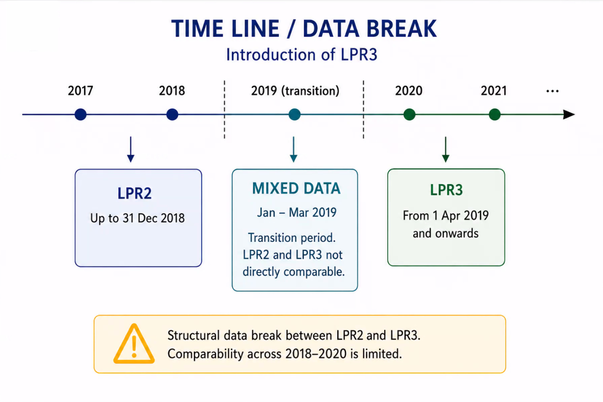

# Danish population registries

This is a list of public danish registries and Danish population datasources that the author, Pipe Galera, knows about. There are also some documentation available at this Statistics Denmark website [here](https://www.dst.dk/en/TilSalg/data-til-forskning/generelt-om-data/data-fra-andre-kilder). I tried to fill the gaps of information not included in this DST list.

Before starting, a good thing to take in mind is that the vast majority of Danish registries are not created to do research. They are unconnected, not in a clean format, disorganized, and they miss documentation (even in Danish). Use DST when possible since it combines and source many of the registries in this list with IDs matched between registries.

## Data Directory (Databejviser)

[Datavejviser.dk](https://datavejviser.dk/) is a catalog of available data from the public sector. It is not a source of data "per se" but a web portal to monitor other sources of data.

- URL: [https://datavejviser.dk/](https://datavejviser.dk/)

## The National Archives (Rigsarkivet)

[The National Archives](https://en.rigsarkivet.dk/) has a massive digitalized archive with Danish data from 1920s to today.

They have many, many registries. Variables like cause of death of individuals (The Historical Cause of Death Register - HDAR) or military conscription records (The Danish Conscription Database) are available.

They have a great intro section for new users in English [here](https://en.rigsarkivet.dk/new-researcher-how-to-get-started/), but you need need Danish to use any data search tool that they provide (e.g. [this one](https://soeg.rigsarkivet.dk/)).

- URL: [The National Archives](https://en.rigsarkivet.dk/)

## The Danish Health Database (Sundhedsdatabanken)

Sundhedsdatabanken (also refered as _SDS_) is a comprehensive Danish digital platform managed by the [The Danish Health Data Authority (Sundhedsdatastyrelsen)](https://sundhedsdatastyrelsen.dk/data-og-registre/sundhedsdatabanken), designed to collect, store, and display statistical data on the Danish healthcare system.

They manage The Danish National Patient Register (Landspatientregisteret) and other clinical registers.

- URL: [https://sundhedsdatastyrelsen.dk/data-og-registre/sundhedsdatabanken](https://sundhedsdatastyrelsen.dk/data-og-registre/sundhedsdatabanken)

## The Danish National Patient Register (Landspatientregisteret)

Managed by The Danish Health Database (_Sundhedsdatabanken_).

It is also refered as "LPR" data. Each time a person has been in contact with the Danish hospital system in connection with, for example, studies or treatments, the hospitals report a number of information. All of this information is collected as data in this registry.

There are some time lines that the researcher should be awere of:

- Established in 1977
- Includes somatic and psychiatric wards
- Only inpatient admissions for early years (1977-1993) and also includes outpatient contacts in recent years (1995-Today)
- Emergency contacts available
- The "International Classification of Diseases" or ICD codes changes. It uses the 8th revision (ICD8) between 1977 and 1994, and the 10th revision (ICD10) from 1994 onward

LPR data has 2 versions, an early LPR2 and the latest LPR3.

- URL: [https://sundhedsdatastyrelsen.dk/data-og-registre/nationale-sundhedsregistre/landspatientregisteret](https://sundhedsdatastyrelsen.dk/data-og-registre/nationale-sundhedsregistre/landspatientregisteret)

### LPR2

- Timeline: 1977-2019
- Contact-based register
- One record per hospital contact (admission/outpatient visit) and only one main diagnosis per contact
- Secondary diagnoses included but less detailed
- Diagnoses summarized at end of contact. Therefore only the final diagnose is available and reflects clinical conclusion
- Limited temporal resolution (e.g. missing time of referrals or procedures)
- For analysis: simpler database to work with than LPR3

### LPR3

- Timeline: 2019-Today.
- Event-based register (e.g. medical examination).
- Multiple records per patient pathway.
- Diagnoses and procedures recorded continuously. All diagnosis are recorded per patient pathway.Therefore multiple diagnosis per patient.
- Greater use of "tentative" or working diagnoses as the coding diagnosis may reflect part of a long diagnose rather than the final diagnose.
- Time-stamped events (e.g., referrals or procedures).
- For analysis: more complex database to work with than LPR2. Homogenizing LPR2 and LPR3 have a risk of misclassification if definitions are not.

## Clinical Databases

Some are managed by The Danish Health Database (_Sundhedsdatabanken_), but some are not. They are approximately 80 in total, but 55 are collected via the epidemiology archive (see URL below)

The medical databases typically cover all patients with a specific disease (e.g. colorectal cancer) or those undergoing a specific surgical procedure (e.g. hip replacement). The databases represent complete cohorts of patients with verified diagnoses, detailed clinical data, and possibility for complete and longitudinal follow-up.

- URL: [https://www.dovepress.com/clinical-epidemiology-archive43-collection3](https://www.dovepress.com/clinical-epidemiology-archive43-collection3)

## The Danish National Prescription Registry

Managed by The Danish Health Database (_Sundhedsdatabanken_).

They record individual-level data on all prescription drugs sold in Danish community pharmacies. All pharmacies in Denmark that prescribe drugs are part of this Danish community of pharmacies, the rest can be pharmacies but cannot prescribe.

The data contains information on dispensed prescriptions, including variables at the level of the drug user, the prescriber, and the pharmacy.

The index is the individual, so you have many records (rows) per inhabitant because the same individual possible take more than 1 medication.

It updates continusly.

Uses Anatomical Therapeutic Chemical (ATC) codes that classify medications.

See more here: [https://www.antonpottegaard.dk/publications/reviews/o80.pdf](https://www.antonpottegaard.dk/publications/reviews/o80.pdf)

## The Danish Register of Causes of Death

It is owned by The National Board of Health and managed by The Danish Health Database (_Sundhedsdatabanken_).

The data covers all deaths among citizens. Itincludes underlying cause, contributing factors and cause of death since 1875. However, not all of these data is digitalized and they only have computerized individual records from the 1970s onwards. You can also go to the The Historical Cause of Death Register - HDAR managed by The National Archive for digitalized data from the 1920s onwards.

Notice that it only includes deaths occurring in Denmark.

The structure is one record (row) per death, so no multiple causes of death per record (e.g. no COVID + cardiovascular disease), and it uses ICD-10 codes to classify the cause of death.

It is updated annually and the new data is stacked on top of the existing data.

**Care**: Denmark has low autopsy rate (missclasification).

See more: [https://pubmed.ncbi.nlm.nih.gov/21775346/](https://pubmed.ncbi.nlm.nih.gov/21775346/)

## The Central Business Register (CVR or Det Centrale Virksomhedsregister)

[The Central Business Register (CVR)](https://danishbusinessauthority.dk/) is the Danish government's master register of information about businesses in Denmark. It contains data on Danish enterprises and Danish trade and industry (e.g. size, location, accounts, employment, development over time etc.).

Most of this data is in Statistics Denmark, so I recommend using that if you have access. Otherwise they do offer a [quick online tool to search](https://cvr.dk/) individually for CVR data or a systematic rest api for downloading CVR data ([API docs](https://cvr.dk/apidocs/))

If you still want to use the CVR API, I recommend using some of the scripts I created in this public repository [here](https://github.com/CBS-SI/CVR_data)

## Education data in different registries

### Register of School Grades (_Grundskolekarakterer_)

It is available in DST (name: `UDFK`) from School year 2001/2002.

Contains data of both public and most private schools. For example, grades from the final years (8th to 10th grade) of Danish compulsory schooling

- URL: [https://www.dst.dk/extranet/ForskningVariabellister/UDFK%20-%20Grundskolekarakterer.html](https://www.dst.dk/extranet/ForskningVariabellister/UDFK%20-%20Grundskolekarakterer.html)

### Final examination grades (`afgangseksamen`)

Grades from mandatory leaving examinations (9th and, where relevant, 10th grade). Both written and oral exams. Subject-specific grades (e.g., Danish, mathematics, English)

### Continuous teacher-assigned grades (`standpunktskarakterer`)

Continuous teacher-assigned grades from 8th to 10th grade. Also subject-specific grades (e.g., Danish, mathematics, English)

It is a measure of ongoing performance rather than "exam performance".

## DREAM register (_Den Registerbaserede Evaluering Af Marginaliseringsomfanget_)

It contains weekly records of all social transfer payments and public benefits received by Danish residents since 1991. Longitudinal format. It includes unemployment benefits, Sickness benefits, Maternity/paternity benefits, Disability pension etc.

It belongs to the Danish Ministry of Employment and is managed by The Danish Agency for Labour Market and Recruitment
