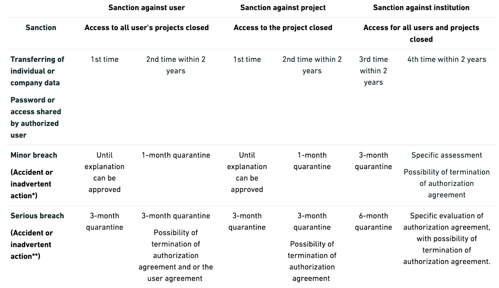

## What's Statistics Denmark (DST)?

_"Statistics Denmark offers remote access to all individual level data that is necessary to carry out a serious research project. [...] individual level data from Statistics
Denmark is not delivered to any external firm, institution, or person. Instead, datasets and linkages between datasets constructed at Statistics Denmark are stored at Statistics Denmark."_ [^1]

_"Researchers employed at specific authorised environments can establish remote online access to these datasets stored at Statistics Denmark. [...] For security reasons, only researchers employed at authorised research institutions can get access to individual level data at Statistics Denmark."_ [^1]

_"Although researcher may get access to rather detailed individual level data, they are only allowed to publish statistical analyses and results at an aggregate level where no single person or enterprise may be identified."_ [^1]

[^1]: [Introduction to Danish (nationwide) registers on health and social
issues: Structure, access, legislation, and archiving](https://journals.sagepub.com/doi/epdf/10.1177/1403494811399956)

## Security Rules Summary

Following the official [rules for data safety under the microdata scheme hereunder rules for transferring analysis results and sanctions in case of data breach](https://www.dst.dk/Site/Dst/SingleFiles/GetArchiveFile.aspx?fi=38014105383&fo=0&ext=forskning):

- No types of micro data can be transferred. Not through the transferring tool or in any other way. No person/business should be recognisable in the transferred output. **This also applies in data where the de-identified ID variable has been removed**. Income, education or socioeconomic status variables are specially penalized. Microdata Example:

| KØN | INDKOMST | BOPÆL     | ALDER |
| --- | -------- | --------- | ----- |
| M   | 1500000  | København | 40    |
| M   | 1500     | Aarhus    | 45    |
| K   | 1000     | Bornholm  | 50    |
| M   | 500      | Bornholm  | 50    |
| M   | 250      | København | 40    |
| M   | 150      | Aarhus    | 20    |
| K   | 150      | Odense    | 25    |
| M   | 750      | Herning   | 35    |
| K   | 500      | København | 60    |
| M   | 250      | Odense    | 65    |
| K   | 150      | Aarhus    | 20    |
| K   | 50       | Bornholm  | 15    |
| M   | 0        | København | 10    |

- **No Pseudonymised key variables**. Personal identification numbers, CVR numbers, workplace numbers, address codes, etc. are always considered microdata as they indicate a unique number that refers directly to a single person or company.

- No tables with less than three observations per cell. Microdata Examples:

| Bopæl          | Antal personer |
| -------------- | -------------- |
|   Bornholm     |   3            |
| **Herning**    | **1**          |
| København      | 4              |
| **Odense**     | **2**          |
|   Aarhus       |   3            |
| Hovedtotal     | 13             |

| Bopæl          | Antal personer | Sum af indkomst |
| -------------- | -------------- | --------------- |
|   Bornholm     |   3            | 1650            |
| **Herning**    | **1**          | 750             |
| København      | 4              | 150750          |
| **Odense**     | **2**          | 400             |
|   Aarhus       |   3            | 1800            |
| Hovedtotal**   | 13             | 155350          |

- **Dominance problem**. For business data, the two largest statistical units (enterprises) together should not exceed 85 % of turnover in a given table cell. Microdata Example:

| Industry      | Number of companies | Profit (kr.) | Profit of two largest companies (kr.) |
|--------------|---------------------|--------------|-------------------------------------|
| Total Industry | 25                  | DKK 100 million | DKK 70 million |
| Sector 1      | 5                   | DKK 30 million | DKK 20 million |
| Sector 2      | 20                  | DKK 70 million | DKK 65 million |

_"For Sector 1, the two largest CVR numbers are 67 %. (20/30) of turnover,
so there is no dominance problem here. However, for Sector 2, the two largest
companies account for 93%. (65/70) of profit, and so we have a problem of
dominance"_ [^2]

[^2]: [Rules for data safety under the microdata scheme hereunder rules for transferring analysis results and sanctions in case of data breach](https://www.dst.dk/Site/Dst/SingleFiles/GetArchiveFile.aspx?fi=38014105383&fo=0&ext=forskning)

- **Max, median and minimum cannot be identifiable**. Percentiles can only be transferred if there is no danger of individual identification.

- **No figures that reveal people or companies**. Example: a scatter plot with "Time" in the horizontal axis and "Capitalization" in the vertical axis - you could really see Novo Nordisk as an outlier and it would kill the principle of anonymity.

- **No code or logs that contains microdata written into a condition or lists**. Please revise tables pasted in `.do` files.

- All work with microdata must be carried out in your workplace or home workplace. You cannot work DST data in public (e.g. train, café).

- The institution register shall not be allowed to transfer information at institution level other than the institution number (e.g. `SI` cannot transfer DST data to `ECON`)

- You can list data in the research machine to validate it, but you cannot export it as it would be a microdata leak.

- *External Sources*. Once you submit your data (e.g. a survey) to be linked to DST data, it is considered microdata regarless of the source and hold the same security standards are DST own data.

## Penalties (researcher scheme)

## Accessing DST Registry Portal

A test on on data security must be passed to get a certification to access Denmark’s Data Portal. It test that your DTS security and privacy knowledge.

Steps to get access to DST Portal:

1. Contact the DST admin of your organization to create a new DST user for you. You can ask the general administration who is this person if you don't know, it is mandatory to have an admin.

2. Log in to Denmark's Data Window using your new three- or four-digit ID and password.

3. On your landing page, select the rightmost window labeled "Learning and Certification."

4. Next, choose the tab labeled "Certifications" and expand it by clicking on the small blue downward-pointing arrow if it is not automatically expanded.

5. Answer the certification questions by clicking on the blue button labeled "Start Certification."

You need to answer all questions correctly.

After the test, you can see under "Result" how many remaining attempts you have and how many questions you answered incorrectly.

## More resources

- [Transferring of analysis results](https://www.dst.dk/en/TilSalg/Forskningsservice/hjemtagelse-af-analyseresultater)

- [Rules for data safety under the microdata scheme hereunder rules for transferring analysis results and sanctions in case of data breach](https://www.dst.dk/Site/Dst/SingleFiles/GetArchiveFile.aspx?fi=38014105383&fo=0&ext=forskning)

- [Certification of Users via Denmark’s Data Portal](https://www.dst.dk/en/TilSalg/Forskningsservice/danmarks-datavindue/om-danmarks-datavindue/certificering-af-brugere)

- [Introduction to Danish (nationwide) registers](https://journals.sagepub.com/doi/epdf/10.1177/1403494811399956)

- [Variable description from Statistics Denmark's Metadata Bank](https://www.dst.dk/da/Statistik/dokumentation/Times)
